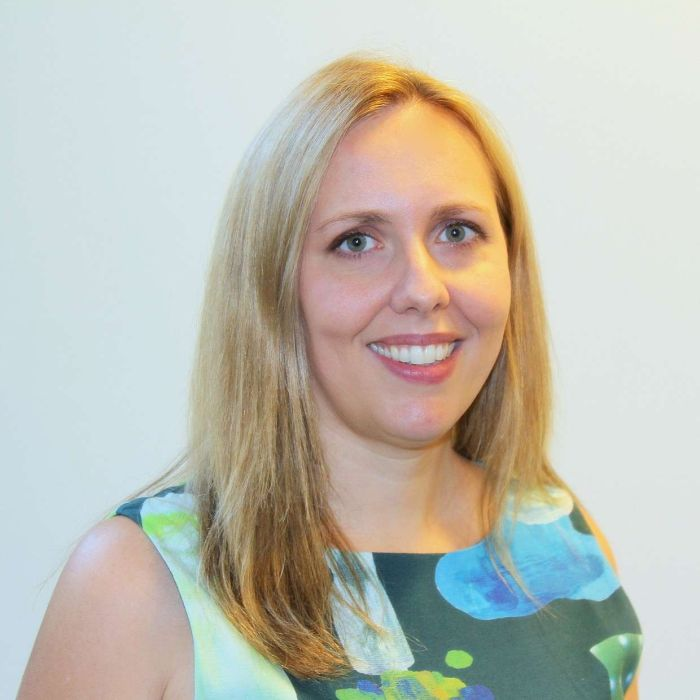

[Associate Professor Jessica Grisham](http://www.psy.unsw.edu.au/contacts-people/academic-staff/associate-professor-jessica-grisham) investigates obsessive-compulsive disorder, hoarding disorder and related disorders.

**What is your current role in the school, and how did you get here?**

I am an Associate Professor and ARC Future Fellow in the School of Psychology. After finishing my undergraduate degree and a Research Assistant stint at the University of Pennsylvania, I went on to do my PhD at Boston University in US. I emigrated to Australia in 2006, and worked initially in the School of Psychiatry with the inimitable Prof Gavin Andrews as a UNSW Vice-Chancellors Postdoctoral Fellow. In 2007, Prof Peter Lovibond and the School of Psychology hiring committee offered me a position as a Lecturer. They very fortunately sensed my potential, despite a few awkward answers during my job talk –including one where I naively explained negative reinforcement to one of the world’s foremost learning experts (Fred Westbrook)! Since then, I have been promoted twice, first to Senior Lecturer and most recently to Associate Professor in 2015, the year I also was awarded my Future Fellowship.

**Why did you choose your specific research area, what excites you about your research?**

During my clinical and research training, I focused broadly on understanding and treating anxiety disorders, but by the end of my PhD I was particularly committed to the study of obsessive-compulsive disorder (OCD), and related disorders like hoarding disorder. My first therapy client had OCD, so there might have been a primacy effect, but I found it to be a particularly fascinating disorder and very rewarding to treat. I later became interested in hoarding disorder due to my experience running a group treatment for hoarding, as well as the incredibly supportive mentorship I received from international hoarding experts in Boston. I am excited about the opportunities we have as OCD researchers to better understand the mechanisms underpinning this perplex and disabling disorder. I am also interested in working to target these factors more precisely in treatment. More broadly, I love being a clinical psychology researcher who has had opportunities to conduct several important types of research: longitudinal, experimental, and intervention studies.

**What do you hope to achieve from your research findings?**

During my clinical and research training, I focused broadly on understanding and treating anxiety disorders, but by the end of my PhD I was particularly committed to the study of obsessive-compulsive disorder (OCD), and related disorders like hoarding disorder. My first therapy client had OCD, so there might have been a primacy effect, but I found it to be a particularly fascinating disorder and very rewarding to treat. I later became interested in hoarding disorder due to my experience running a group treatment for hoarding, as well as the incredibly supportive mentorship I received from international hoarding experts in Boston. I am excited about the opportunities we have as OCD researchers to better understand the mechanisms underpinning this perplex and disabling disorder. I am also interested in working to target these factors more precisely in treatment. More broadly, I love being a clinical psychology researcher who has had opportunities to conduct several important types of research: longitudinal, experimental, and intervention studies.

**What has been your experience of undertaking research at UNSW in the School of Psychology?**

The School of Psychology at UNSW has been a very supportive research environment for me, with a few factors that stand out. First, my colleagues in Psychology are extraordinary. Many of them have inspired me and helped me to design and conduct better research. Second, the calibre of the students in Psychology at UNSW is excellent. One of my favourite parts of my job is working with bright, enthusiastic postgraduate students, which sustains my own excitement. My PhD students in particular are wonderful! Finally, we receive a lot of support from Simon, the School, and the Faculty with respect to funds, equipment and technical support. Amazing administrative and technical staff, like Jonathan in the Tech Support Unit, Socrates in finance, and many others, make it very positive place for me to do my work.

