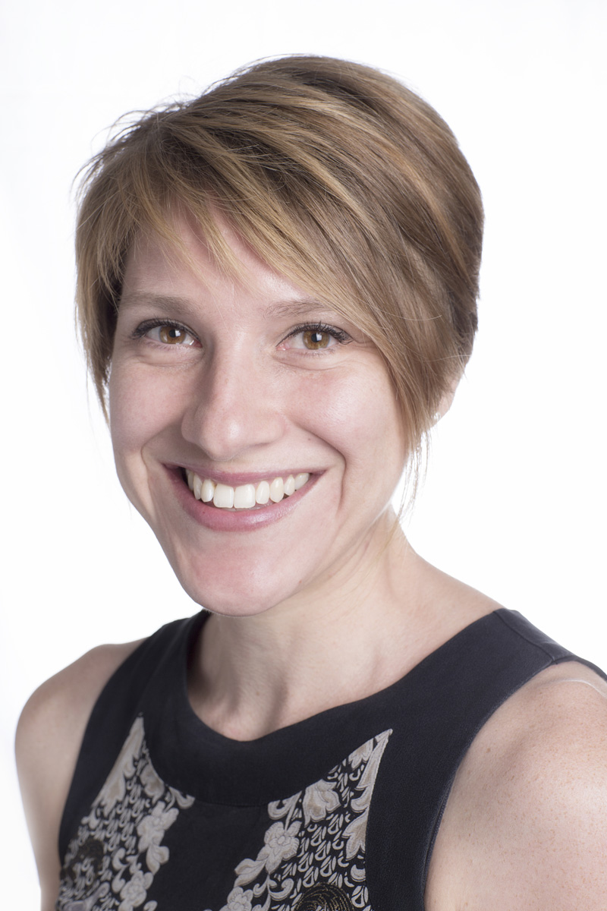

[Dr Kristy Martire](http://www.psy.unsw.edu.au/contacts-people/academic-staff/dr-kristy-martire) is a Forensic Psychologist who trains students in the Master of Psychology (Forensic) Program. Kristy also examines the role and comprehension of expert evidence in criminal trials.

**What is your current role in the school, and how did you get here?**

I am a Senior Lecturer and former ARC DECRA Fellow in the School of Psychology at UNSW. I completed my Master of Psychology and PhD in Forensic Psychology at UNSW. After that I took up a three-year postdoctoral fellowship at the National Drug & Alcohol Research Centre (NDARC) examining the relationship between substance use and crime. I came back to the School of Psychology in 2011 in an academic position and have been here teaching and researching ever since.

**Why did you choose your specific research area, what excites you about your research?**

I chose forensic psychology research because it allows me to apply cognitive science theories and methods to some of the problems currently facing criminal justice systems around the world. Expert forensic science evidence plays an important role in many criminal trials, yet it is complex, difficult to communicate accurately, often poorly understood and increasingly the subject of serious criticism. In my work I have the opportunity to draw from literatures on risk communication, decision making and expertise to develop innovative and exciting perspectives on expert evidence and to propose evidence-based strategies for improvement. By working in this area I am also able to collaborate with a great group of professionals from a diverse range of backgrounds, from legal academics and practitioners to police officers and scientists. That means I have the opportunity to see the same problem from a range of different perspectives which is both challenging and rewarding.

**What do you hope to achieve from your research findings?**

I hope to be able to improve the fairness and accuracy of our criminal justice system by improving the quality and comprehension of expert evidence in criminal trials.

**What has been your experience of undertaking research at UNSW in the School of Psychology?**

My experience undertaking research at UNSW and the School of Psychology has been very varied. I have collected data online, in person with undergraduates and with community members. I have surveyed experts from around the world, examined large administrative data sets of fines, offences, and health outcomes and have spoken with offenders and parolees. With a little bit of imagination and some persistence there is no limit to the exiting research that you can do.

