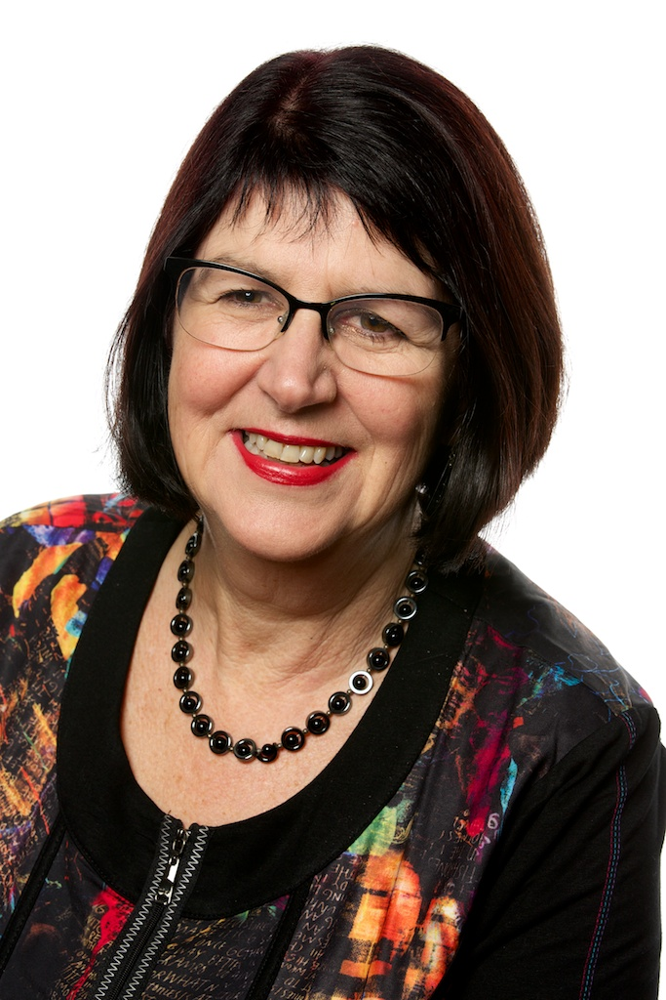

[Professor Skye McDonalds](http://www.psy.unsw.edu.au/contacts-people/academic-staff/professor-skye-mcdonald) research in neuropsychology is essentially concerned with disorders that arise from brain dysfunction due to structural or developmental conditions.

**What is your current role in the school, and how did you get here?**

I am one of three women Professors in the School of Psychology. I have worked here for 23 years. I commenced as a lecturer at UNSW after obtaining my PhD in 1993. Prior to that I worked as a clinical neuropsychologist. Over the time I have been at UNSW I have raised two daughters who are now in their 20s.

**Why did you choose your specific research area, what excites you about your research?**

My chosen field of research emerged from my work as a clinician. I was intrigued by the changes in personality and socioemotional function that people experienced following brain damage. Many of these were elusive to measure let alone treat but diabolical in terms of how they impacted on people’s lives.

**What do you hope to achieve from your research findings?**

My research has two prongs, a theoretical goal and a clinically practical goal.

In terms of theory, by observing people with brain damage, my research is designed to reveal how the brain is functionally organised, especially with respect to emotion and social cognition. While contemporary neuroimaging is hugely popular as a means to understand brain function, there are many questions it cannot answer. Clinical neuropsychology, the study of people with brain damage is a valuable complement.

In clinical terms, I hope to improve our capacity to accurately assess people with brain injury for their socioemotional abilities and to offer effective treatments that are based on scientific evidence.

**What has been your experience of undertaking research at UNSW in the School of Psychology?**

UNSW and Psychology in particular, has been very supportive of my research. I experience practical problems with the recruitment of clinical subjects which is probably the biggest hurdle I face. Otherwise, I have found an academic career hugely satisfying. It is hard work but also it provides flexibility (such as face to face working hours) which has enabled me to progress in my career as well as parent two children.

